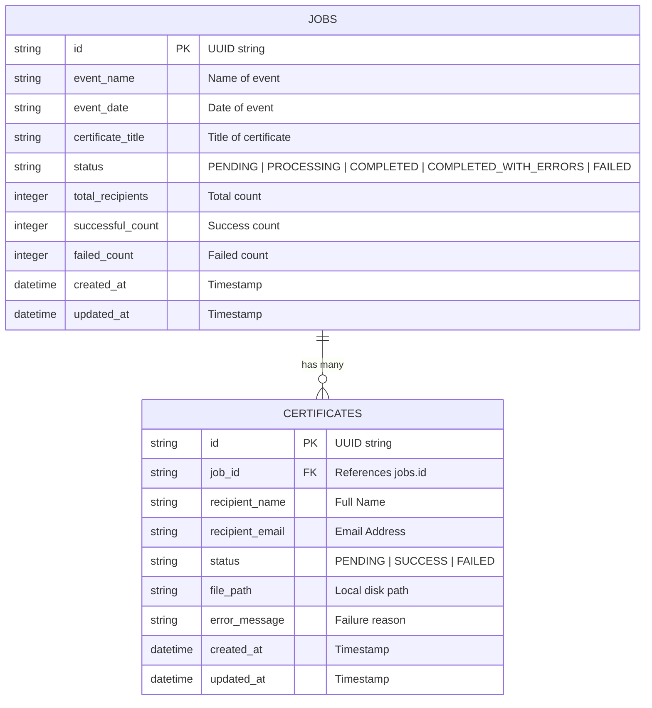

# Bulk Certificate Generator API

An asynchronous, production-ready REST API built with **FastAPI**, **SQLAlchemy ORM**, **ReportLab**, and **Pydantic V2** to handle bulk certificate generation requests for event recipients.

Built for the **Intern - Software Development Engineer** backend assignment at **Aereo**.

---

## 🚀 Features

- **Async Bulk Request Processing**: Accepts bulk recipient lists in a single HTTP request and enqueues background PDF rendering immediately (`HTTP 202 Accepted`).
- **Failure Isolation**: A rendering failure for a single recipient (e.g. data corruption) does NOT terminate the rest of the bulk job.
- **Granular Status Tracking**: Tracks individual certificate statuses (`SUCCESS`, `FAILED`) and overall job statuses (`PENDING`, `PROCESSING`, `COMPLETED`, `COMPLETED_WITH_ERRORS`, `FAILED`).
- **Dynamic PDF Certificate Rendering**: Renders landscape PDF certificates with custom styling, borders, recipient names, event dates, and unique certificate IDs using ReportLab.
- **RESTful Certificate Retrieval**: Download generated PDF certificates directly via endpoint.
- **Strict Data Validation**: Pydantic schemas validate recipient names, email formats (`EmailStr`), non-empty strings, and reject empty recipient lists (`HTTP 422 Unprocessable Entity`).
- **100% Automated Test Coverage**: Comprehensive `pytest` test suite covering validation, job creation, background execution, partial failure isolation, and download endpoints.
- **Containerized Deployment**: Fully Dockerized with `Dockerfile` and `docker-compose.yml`.

---

## 🛠️ Tech Stack & Design Rationale

| Technology | Purpose | Rationale |
| :--- | :--- | :--- |
| **Python 3.11+** | Language | High readability, rich library ecosystem. |
| **FastAPI** | Web Framework | Asynchronous capabilities (`async`/`await`), auto-generated OpenAPI documentation, fast execution based on Starlette and Pydantic. |
| **SQLAlchemy** | Database ORM | Industry standard ORM for Python. Eliminates SQL injection risks, abstracts relational operations, handles connection pools. |
| **SQLite** | Database | Zero-config relational database for local development and testing. Easy transition to PostgreSQL by changing `DATABASE_URL`. |
| **Pydantic V2** | Validation & Parsing | Fast data parsing, email format verification, and clean JSON payload serialization. |
| **ReportLab** | PDF Generation | Battle-tested Python engine for drawing PDF documents programmatically. |
| **FastAPI BackgroundTasks** | Task Execution | Native task execution requiring zero external queue setup for small-to-medium bulk generation. |
| **pytest & TestClient** | Testing | Fast, isolated automated API endpoint testing with in-memory SQLite fixtures. |
| **Docker & Docker Compose** | Containerization | Reproducible environment configuration across host machines. |

---

## 🏗️ Architecture & Component Layers

```text
                  ┌───────────────────────────────┐
                  │          API Client           │
                  └──────────────┬────────────────┘
                                 │ HTTP Request
                                 ▼
                  ┌───────────────────────────────┐
                  │     API Layer (Routes)        │
                  │  app/api/routes/jobs.py       │
                  │  app/api/routes/certificates  │
                  └──────────────┬────────────────┘
                                 │
           ┌─────────────────────┼─────────────────────┐
           ▼                     ▼                     ▼
┌────────────────────┐ ┌──────────────────┐ ┌───────────────────┐
│ Schemas (Pydantic) │ │ Service Layer    │ │ Database (Models) │
│ - Input validation │ │ - Job Service    │ │ - Job Table       │
│ - Response types   │ │ - PDF Service    │ │ - Certificate     │
│                    │ │ - Storage        │ │   Table           │
└────────────────────┘ └─────────┬────────┘ └───────────────────┘
                                 │ Background Exec
                                 ▼
                       ┌───────────────────┐
                       │ Local Disk / PDF  │
                       │ Storage Directory │
                       └───────────────────┘
```

---

## 🗄️ Database Design (Entity-Relationship Diagram)



---

## 📁 Project Structure

```text
AEREO/
├── app/
│   ├── main.py                     # FastAPI application entrypoint & error handlers
│   ├── api/
│   │   ├── router.py               # Main API router aggregator
│   │   └── routes/
│   │       ├── jobs.py             # Bulk job endpoints (/api/jobs)
│   │       └── certificates.py     # PDF download endpoints (/api/certificates)
│   ├── core/
│   │   └── config.py               # Environment configuration settings
│   ├── database/
│   │   └── database.py             # SQLAlchemy engine & DB session dependency
│   ├── models/
│   │   ├── job.py                  # Job ORM model & status enum
│   │   └── certificate.py          # Certificate ORM model & status enum
│   ├── schemas/
│   │   ├── job.py                  # Pydantic schemas for Job request/response
│   │   └── certificate.py          # Pydantic schemas for Certificate request/response
│   └── services/
│       ├── pdf_service.py          # ReportLab PDF rendering engine
│       ├── storage_service.py      # Abstract file storage interface & local implementation
│       └── job_service.py          # Job orchestration & background worker
├── tests/
│   ├── conftest.py                 # Pytest fixtures & DB test setup
│   ├── test_jobs.py                # Job creation & status tests
│   ├── test_validation.py          # Pydantic validation tests
│   ├── test_certificates.py        # Certificate listing & download tests
│   └── test_failures.py            # Failure isolation & partial completion tests
├── generated_certificates/         # Rendered PDF output directory
├── Dockerfile                      # Docker image definition
├── docker-compose.yml              # Container orchestration configuration
├── requirements.txt                # Python project dependencies
├── .env.example                    # Sample environment settings
├── .gitignore                      # Git exclusion rules
└── README.md                       # Comprehensive documentation
```

---

## ⚡ API Endpoints & Request Examples

### 1. Create Bulk Generation Job
**`POST /api/jobs/`**  
Status: `202 Accepted`

#### Request Body
```json
{
  "event_name": "Aereo Hackathon 2026",
  "event_date": "2026-10-07",
  "certificate_title": "Certificate of Participation",
  "recipients": [
    { "name": "Rahul Sharma", "email": "rahul@example.com" },
    { "name": "Priya Kumar", "email": "priya@example.com" },
    { "name": "Ananya Rao", "email": "ananya@example.com" }
  ]
}
```

#### Response Body
```json
{
  "job_id": "8cddd42b-70bd-4860-8954-3aebc359a2f8",
  "status": "PENDING",
  "total_recipients": 3
}
```

---

### 2. Check Job Progress & Summary
**`GET /api/jobs/{job_id}`**  
Status: `200 OK`

#### Response Body
```json
{
  "job_id": "8cddd42b-70bd-4860-8954-3aebc359a2f8",
  "event_name": "Aereo Hackathon 2026",
  "event_date": "2026-10-07",
  "certificate_title": "Certificate of Participation",
  "status": "COMPLETED",
  "total": 3,
  "successful": 3,
  "failed": 0,
  "created_at": "2026-10-07T07:02:00.913467",
  "updated_at": "2026-10-07T07:02:01.270701"
}
```

If some recipients fail rendering:
```json
{
  "job_id": "8cddd42b-70bd-4860-8954-3aebc359a2f8",
  "status": "COMPLETED_WITH_ERRORS",
  "total": 3,
  "successful": 2,
  "failed": 1
}
```

---

### 3. Retrieve Certificate Details for a Job
**`GET /api/jobs/{job_id}/certificates`**  
Status: `200 OK`

#### Response Body
```json
{
  "job_id": "8cddd42b-70bd-4860-8954-3aebc359a2f8",
  "total": 3,
  "certificates": [
    {
      "id": "979414cb-112c-476e-8bb4-10fa76a176c9",
      "job_id": "8cddd42b-70bd-4860-8954-3aebc359a2f8",
      "recipient_name": "Rahul Sharma",
      "recipient_email": "rahul@example.com",
      "status": "SUCCESS",
      "file_path": ".../generated_certificates/certificate_979414cb.pdf",
      "error_message": null,
      "created_at": "2026-10-07T07:02:00.923966",
      "updated_at": "2026-10-07T07:02:01.065633"
    }
  ]
}
```

---

### 4. Download Generated PDF Certificate
**`GET /api/certificates/{certificate_id}`**  
Status: `200 OK` (`Content-Type: application/pdf`)

Downloads the generated PDF file directly in the browser or HTTP client.

---

## 🔄 Background Processing Decision & Limitations

### Why FastAPI `BackgroundTasks`?
FastAPI's built-in `BackgroundTasks` was selected for this assignment because it keeps the application **lightweight**, **zero-dependency**, and **easy to run/test** without requiring complex external message brokers like Redis or RabbitMQ.

### Production Limitations of `BackgroundTasks`
1. **In-Process Memory Execution**: Tasks run in the same process as the web server (Uvicorn). Heavy CPU rendering can impact HTTP request throughput.
2. **No Task Persistence**: If the server crashes or restarts during execution, pending in-memory tasks are lost.
3. **No Distributed Scaling**: Tasks cannot be distributed across multiple worker nodes.

### Future Scope (Celery + Redis Architecture)
For scale (e.g. 100,000 certificates per job), we would replace `BackgroundTasks` with:
- **Broker**: Redis or RabbitMQ
- **Worker Queue**: Celery or ARQ
- **Storage**: AWS S3 via `S3StorageService`

```text
API Client ──► POST /api/jobs/ ──► FastAPI Server
                                        │
                                        ▼ (Publish Message)
                                   Redis Broker
                                        │
                                        ▼ (Consume Task)
                                 Celery Worker Nodes ──► Render PDF ──► Write to AWS S3
```

---

## ⚙️ Running Locally

### 1. Prerequisites
- Python 3.11+
- Virtual environment (`venv`)

### 2. Setup Virtual Environment
```powershell
# Clone the repository
git clone https://github.com/Darshi7587/Certificate_Generation.git
cd Certificate_Generation

# Create virtual environment
python -m venv venv

# Activate virtual environment (Windows)
.\venv\Scripts\activate

# Install dependencies
pip install -r requirements.txt
```

### 3. Configure Environment Variables
Copy `.env.example` to `.env`:
```powershell
cp .env.example .env
```

### 4. Run the API Server
```powershell
uvicorn app.main:app --reload --host 127.0.0.1 --port 8000
```
Visit interactive Swagger documentation at: `http://127.0.0.1:8000/docs`

---

## 🧪 Running Automated Tests

Run the complete `pytest` test suite:
```powershell
pytest -v
```

Expected test result:
```text
tests/test_certificates.py::test_get_certificates_for_job PASSED
tests/test_certificates.py::test_download_generated_certificate PASSED
tests/test_certificates.py::test_download_nonexistent_certificate PASSED
tests/test_failures.py::test_individual_certificate_failure_isolation PASSED
tests/test_jobs.py::test_create_bulk_job PASSED
tests/test_jobs.py::test_get_job_status PASSED
tests/test_jobs.py::test_get_nonexistent_job PASSED
tests/test_validation.py::test_empty_recipients_validation PASSED
tests/test_validation.py::test_invalid_email_validation PASSED
tests/test_validation.py::test_missing_recipient_name_validation PASSED

======================= 10 passed in 4.69s =======================
```

---

## 🐳 Docker Setup

Run the application inside Docker:

```bash
# Build and run containers
docker-compose up --build
```

Access the API at `http://localhost:8000/docs`.

To stop the containers:
```bash
docker-compose down
```

---

## 🎓 Learning Outcomes & Key Concepts Mastered

1. **Clean Layered Architecture**: Clear separation between routes, Pydantic schemas, SQLAlchemy models, and business services.
2. **Failure Isolation**: Designing asynchronous background loops to log and isolate single-item errors without stopping bulk batch jobs.
3. **Pydantic V2 Validation**: Validating nested objects, emails, and custom string rules.
4. **Abstract Storage Design**: Preparing applications for cloud storage (AWS S3) using abstract interfaces.
5. **Database Session Lifecycles**: Managing thread-safe DB transactions with FastAPI `get_db` dependencies and `yield`.
6. **Automated Integration Testing**: Testing asynchronous web applications with pytest fixtures and mocking.
